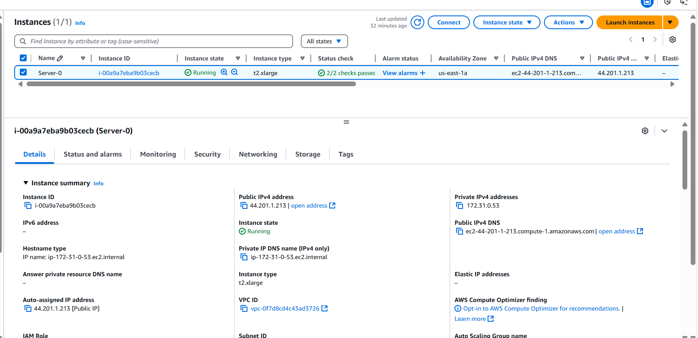

# Deploy Starbucks Clone Application AWS using DevSecOps Approach

https://github.com/user-attachments/assets/0548f82b-c4d6-4ac7-beec-a1e1eb4f1bb2


## Tools Used

<a href="https://code.visualstudio.com/">
  
</a>
<a href="https://git-scm.com/">
  
</a>
<a href="https://github.com">
  
</a>
<a href="https://www.kernel.org">
  
</a> 
<a href="https://www.docker.com">
  
</a>
<a href="https://docker.p2hp.com/wp-content/uploads/2023/10/home-hero-scout.png">
  
</a> 
<a href="https://nodejs.org/">
  
</a>
<a href="https://reactjs.org/">
  
</a>
<a href="https://www.npmjs.com/">
  
</a>
<a href="https://logospng.org/wp-content/uploads/java-768x432.png">
  
</a>
<a href="https://www.jenkins.io">
  
</a>
<a href="https://github.com/tonistiigi/trivy">
  
</a>
<a href="https://www.svgrepo.com/show/354365/sonarqube.svg">
  
</a>
<a href="https://roost.ai/hubfs/logos/integrations/logo-dockerhub.png">
  
</a>
<a href="https://nginx.org/">
  
</a>
<a href="https://www.terraform.io">
  
</a>
<a href="https://cdn.freelogovectors.net/wp-content/uploads/2021/07/owasp_logo-freelogovectors.net_.png">
  
</a>
<a href="https://www.svgrepo.com/show/349378/gmail.svg">
  
</a>
<a href="https://aws.amazon.com">
  
</a>
<a href="https://icon.icepanel.io/AWS/svg/Security-Identity-Compliance/IAM-Identity-Center.svg">
  
</a>
<a href="https://icon.icepanel.io/AWS/svg/Compute/EC2.svg">
  
</a>


### Project Description: 

### Starbucks Clone Application Deployment on AWS Using DevSecOps Approach

This project demonstrates the deployment of a **Starbucks clone application** on an **AWS EC2** instance using a **DevSecOps** approach, ensuring that security is integrated throughout the entire lifecycle of development, deployment, and operations. The deployment leverages a combination of modern cloud technologies, CI/CD practices, and security tools to ensure the application is not only functional but also secure by design.

### Key Features:
- **DevSecOps Approach**: The project integrates security practices directly into the **CI/CD pipeline** and infrastructure, ensuring that security is not an afterthought but a continuous process throughout the development and deployment lifecycle.
- **AWS EC2**: The application is hosted on an **EC2 instance**, ensuring scalable, cost-effective cloud infrastructure.
- **Terraform**: Used for infrastructure automation, enabling the provisioning of AWS resources (EC2, IAM, etc.) in a secure and repeatable manner through **Infrastructure as Code (IaC)**.
- **Jenkins**: Automates the CI/CD pipeline, managing tasks like code builds, tests, and deployments. Jenkins ensures that any changes to the code are continuously integrated and deployed to AWS.
- **SonarQube**: Integrated into the CI/CD pipeline for **static code analysis**, ensuring that the application code meets high standards for quality, maintainability, and security.
- **Docker**: The application is containerized using **Docker**, ensuring that it runs consistently across various environments.
- **Docker Scout**: Scans Docker images for vulnerabilities, helping to ensure that only secure, production-ready containers are deployed.
- **OWASP**: The project implements **OWASP security practices** to mitigate common web application vulnerabilities, integrating these best practices into the development process.
- **Trivy**: A tool used for scanning Docker images for security vulnerabilities, ensuring that the containers are free from known security issues before deployment.
- **Node.js & Java**: The Starbucks clone application utilizes **Node.js** for the frontend and **Java** for backend services, enabling a robust and scalable application.

### Tools and Technologies Used:
- **Git/GitHub**: Version control system to manage the application’s source code and Terraform configurations.
- **AWS EC2**: Cloud service used to host the Starbucks clone application on an EC2 instance.
  - **IAM Users**: Ensures that the right permissions and access controls are enforced for secure interaction with AWS resources.
- **Terraform**: Infrastructure as Code tool used for provisioning AWS resources in a repeatable, automated manner, ensuring security configurations are part of the infrastructure setup.
- **Jenkins**: A powerful CI/CD tool that automates the pipeline for building, testing, and deploying the application.
- **SonarQube**: Integrated into the pipeline for continuous code quality checks, including security vulnerabilities, bugs, and code smells.
- **Docker**: The application is containerized to ensure consistency across development, testing, and production environments.
- **Docker Scout**: Analyzes Docker images for vulnerabilities to ensure only secure images are used.
- **Trivy**: A tool that scans Docker images for known vulnerabilities and provides a security report to ensure secure deployments.
- **OWASP**: Implements security best practices and guidelines to mitigate common vulnerabilities such as SQL injection, cross-site scripting (XSS), and other OWASP top 10 risks.
- **Node.js**: Used for developing the frontend of the application.
- **Java**: Backend logic is implemented using **Java**, ensuring the application is robust and scalable.

### Workflow:
1. **Version Control**: Code is stored in a **GitHub** repository, where developers collaborate and push updates.
2. **Infrastructure Provisioning**: **Terraform** provisions AWS resources like EC2 instances, IAM users, and other components in a secure and automated manner.
3. **CI/CD Pipeline**: 
   - **Jenkins** automates the process of building the application, running tests, and deploying it to AWS.
   - **SonarQube** runs during the build process to perform static code analysis for security vulnerabilities.
4. **Containerization**: The application is packaged into **Docker** containers, ensuring that the application environment is consistent from development to production.
5. **Security Scanning**:
   - **OWASP** security guidelines are integrated into the development process.
   - **Docker Scout** and **Trivy** scan Docker images to detect and fix security vulnerabilities before deployment.
6. **Deployment**: Once the application passes tests and security checks, it is automatically deployed to the **AWS EC2** instance, making it accessible to users.

---
## Deployment Stages


---

##  Create EC2 Instance  with Terraform , 
**-ref: Terraform/**

- **AMI**: Amazon Linux
- **Instance Type**: t2.xlarge
- **Key Pair**: `starbucks-key`
- **Security Group Rules**:
  - Port 22: SSH
  - Port 8080: Jenkins
  - Port 9000: SonarQube
- **Storage**: 30GB gp3

### User Data Script
```bash
#!/bin/bash
# Update and install prerequisites
sudo yum update -y
sudo yum install -y curl tar gzip wget

# JDK 17 installation
echo "Installing Amazon Corretto JDK 17..."
sudo rpm --import https://yum.corretto.aws/corretto.key
sudo curl -L -o /etc/yum.repos.d/corretto.repo https://yum.corretto.aws/corretto.repo
sudo yum install -y java-17-amazon-corretto
echo "export JAVA_HOME=/usr/lib/jvm/java-17-amazon-corretto" | sudo tee -a /etc/profile
echo "export PATH=\$PATH:\$JAVA_HOME/bin" | sudo tee -a /etc/profile
source /etc/profile

# Verify Java installation
java -version

# Git installation
sudo yum install -y git* --skip-broken
git --version

# Jenkins installation
sudo wget -O /etc/yum.repos.d/jenkins.repo https://pkg.jenkins.io/redhat-stable/jenkins.repo
sudo rpm --import https://pkg.jenkins.io/redhat-stable/jenkins.io-2023.key
sudo yum upgrade -y
sudo yum install -y jenkins
sudo systemctl daemon-reload
sudo systemctl enable jenkins
sudo systemctl start jenkins

# Docker installation
sudo amazon-linux-extras install docker
sudo yum install -y docker
sudo systemctl start docker
sudo systemctl enable docker
sudo usermod -aG docker jenkins
sudo chmod 666 /var/run/docker.sock

# Docker Compose installation
wget https://github.com/docker/compose/releases/download/v2.32.4/docker-compose-linux-x86_64
sudo mv docker-compose-linux-x86_64 /usr/bin/docker-compose
sudo chmod +x /usr/bin/docker-compose
docker-compose version

# Docker Scout installation
curl -sSfL https://raw.githubusercontent.com/docker/scout-cli/main/install.sh -o install-scout.sh
sudo sh install-scout.sh -b /usr/local/bin
docker-scout version
sudo mkdir -p /tmp/docker-scout/sha256
sudo chown -R jenkins:jenkins /tmp/docker-scout/

# Install Trivy for security scanning
cat << EOF | sudo tee /etc/yum.repos.d/trivy.repo
[trivy]
name=Trivy repository
baseurl=https://aquasecurity.github.io/trivy-repo/rpm/releases/\$basearch/
gpgcheck=1
enabled=1
gpgkey=https://aquasecurity.github.io/trivy-repo/rpm/public.key
EOF
sudo yum -y update
sudo yum -y install trivy
trivy --version

# Display Jenkins access information
IP_ADDRESS=$(hostname -I | awk '{print $1}')
echo "Access Jenkins at: http://$IP_ADDRESS:8080"
```

---
## Steps to Run the Code

1. **Clone the repository**:
   If the Terraform configuration is stored in a Git repository, you can clone it to your local machine.
   ```bash
   git clone https://github.com/Gaurav1517/Starbucks-clone-CICD.git
   cd Starbucks-clone-CICD
   ```

2. **Initialize Terraform**:
   Run the `terraform init` command to initialize your Terraform working directory. This will download the necessary provider plugins.
   ```bash
   terraform init
   ```

3. **Validate the Configuration**:
   Ensure that your Terraform configuration is valid by running the `terraform validate` command.
   ```bash
   terraform validate
   ```

4. **Format the Code**:
   Format the Terraform code to follow the standard code style.
   ```bash
   terraform fmt
   ```

5. **Review the Execution Plan**:
   Before applying any changes, run `terraform plan` to review the actions Terraform will take on your AWS environment.
   ```bash
   terraform plan
   ```

6. **Apply the Configuration**:
   Apply the configuration to create the resources in AWS.
   ```bash
   terraform apply
   ```
  
  
---

## Accessing the EC2 Instance
1. Change permissions for the key pair:
   ```bash
   chmod 400 "starbucks-key.pem"
   ```
2. SSH into the instance:
   ```bash
   ssh -i "starbucks-key.pem" ec2-user@<public-ip>
   ```

---
## Verify user data packages are configured successfully.
  ```bash
  java -version
  docker -v
  docker-scout version
  jenkins --version
  git --version
  ```

## Installing SonarQube on Docker
1. Pull and run the SonarQube Docker container:
   ```bash
   docker run -d --name sonarqube -p 9000:9000 sonarqube:lts-community
   ```
2. Verify the container:
   ```bash
   docker ps
   ```
   
   
4. Access SonarQube in your browser:
   ```
   http://<ec2-ip>:9000
   ```
5. Default credentials:
   - Username: `admin`
   - Password: `admin`
   - Update the password upon first login.

   
   
---

## Jenkins Setup
1. Access Jenkins:
   ```
   http://<ec2-ip>:8080
   ```
   
   
   
   
   
   
   
2. Unlock Jenkins with the initial password:
   ```bash
   sudo cat /var/lib/jenkins/secrets/initialAdminPassword
   ```
3. Install recommended plugins:
   - Eclipse Tamarin Installer
   - SonarQube Scanner
   - NodeJS
   - Docker Commons
   - OWASP Dependency-Check
   - Email Extension Template
   - Blue Ocean
   
   
   
   
   

4. Configure SonarQube integration:
   - Generate a token in SonarQube (`Administrator > Security > Tokens`).
   
   
   
  - Add credentials in Jenkins (`Manage Jenkins > Credentials`).
   

  - Create webhook in sonarqube
   
   
   
   

  - Configure sonar in system "SonarQube servers"
    Dashboard > Manage Jenkins > System > SonarQube servers
   
  

5. Configure Docker Hub integration:
   - Create a token in Docker Hub (`My Account > Security > New Access Token`).
   
   
   
   - Add credentials in Jenkins (`Manage Jenkins > Credentials`).
   
  - Docker login for docker-scout
  

6. Sure! Here’s a concise description of configuring tools in Jenkins:

---

### Configuring Tools in Jenkins Dashboard

To configure tools like JDK, Node.js, SonarQube, Dependency-Check, and Docker in Jenkins, follow these steps:

1. **Navigate to Jenkins Dashboard**  
   Go to **Manage Jenkins** > **Global Tool Configuration**.

2. **Configure JDK**  
   - Add JDK installations (e.g., JDK 17) under the **JDK** section by providing the name (`jdk17`) and the installation path or auto-installation option.

3. **Configure Node.js**  
   - Add Node.js version (e.g., `nodejs16`) under the **NodeJS** section by providing the version name and installation method.

4. **Configure SonarQube**  
   - Under **SonarQube servers**, add the SonarQube server details, including the server name and URL, to integrate with Jenkins.

5. **Configure Dependency-Check**  
   - Under **Dependency-Check** section, specify the installation details to use Dependency-Check for security analysis.

6. **Configure Docker**  
   - For **Docker**, specify the installation path or use the auto-installation option to install the latest version of Docker.

After saving, Jenkins will have the configured tools available for use in pipelines and jobs.

   
   
   
   
   
---

## Email Notification Setup
1. Create App password in gmail
  
  
  
  
  

2. Add email credentials
 
   
3. configure in jenkins "Extended E-mail Notification & E-mail Notification"
- **SMTP Server**: smtp.gmail.com
- **SMTP Port**: 465
- **Authentication**: Use your Gmail credentials with an app-specific password or OAuth2.
  
  
  
  
  
---

## Dockerfile
- **Ref Dockerfile** 
---

## Here’s a step-by-step guide for configuring a shared library in Jenkins based on your requirements:

# Configuring a Shared Library in Jenkins

Configure the shared library in Jenkins using the repository: 
```bash
   https://github.com/Gaurav1517/public-shared-library.git
```

### Step 1: Set Up the Shared Library in the Repository
In your GitHub repository, navigate to the path `sharedLibrary/vars/hello.groovy`. Create a Groovy file that defines a simple method. For example:

eg. 
```groovy
// public-shared-library/vars/hello.groovy
def call(String message) {
    echo "Hello from Shared Library! Message: ${message}"
}
NOTE: ALL STAGES FUNCTIONS WILL BE CALL FROM THIS REPOSITORY.
```

This will be the function you’ll call from Jenkins pipelines.

### Steps 2 : Configure Shared Library in Jenkins

1. **Navigate to Jenkins Dashboard**  
   - Open Jenkins and go to **Manage Jenkins**.
   
2. **Access Global Pipeline Libraries Configuration**  
   - Under **Manage Jenkins**, click on **Configure System**.
   - Scroll down to the **Global Pipeline Libraries** section.

3. **Add a New Library**  
   - Click **Add** and configure the shared library:
     - **Name**: `Shared` (This will be the name you'll use in Jenkinsfiles)
     - **Default version**: `main` (This is the branch from the Git repository to be used)
     - **Currently maps to revision**: `e407b8379e0c69b95ef2feb14695637042efe939` (This is the commit hash you want to use. If you want the latest, leave it as is or use `main` for the latest commit).
   
4. **Configure Additional Settings**:
   - **Load implicitly**: Check this box if you want the library to be loaded automatically.
   - **Allow default version to be overridden**: Optionally, check this box to allow overriding the default version in individual Jenkinsfiles.
   - **Include @Library changes in job recent changes**: Enable this to track changes from the library in your Jenkins job changes history.
   - **Cache fetched versions on controller for quick retrieval**: Enable this for performance optimization.
   
5. **Select SCM Configuration**:
   - **Retrieval method**: Choose `Modern SCM` to retrieve the shared library using a modern interface.
   - **Source Code Management**:
     - Select **Git**.
     - **Project Repository**: Enter the URL: `https://github.com/Gaurav1517/public-shared-library.git`
     - **Credentials**: Select `- none -` if the repository is public.
   - **Behaviors**:
     - Click **Add** and select **Discover branches**.
     - Click **Add** and select **Fresh clone per build**.
   
6. **Library Path**:  
   - Leave this as `./` to specify the root directory of the library.

7. **Save Configuration**:  
   - Click **Apply** and then **Save** to finalize the configuration.

### Step 3: Use the Shared Library in a Jenkins Pipeline

In your Jenkinsfile, you can now load and use the shared library:
Syntax to call shared library
```groovy
@Library('Shared') _

node {
    hello('This is a message from the Shared Library!')
}
```

This will call the `hello` function from your shared library and print the message in the Jenkins console output.


---


## Steps to create pipeline 
Create a New Pipeline
Click on the New Item menu within Jenkins.
Provide a name for your new item (e.g., starbucks) and select Pipeline.
Click OK


## Jenkinsfile
- **Ref Jenkinsfile**

Ouputs: 
jenkins pipeline output (stage view pipeline)

jenkins pipeline output (blue ocean pipeline)

docker-scout log

sonarqube test results


email-notification 


Application live browse from browser <<public-IP:3000>>

